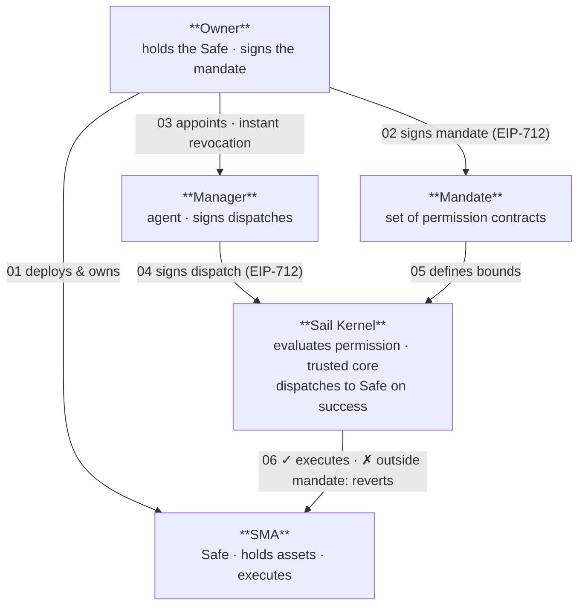

# Sailor

> The operator toolkit for Sail Protocol — SDK, CLI, and local dashboard for building and running mandated agents.

Sailor is the off-chain operator layer for [Sail Protocol](https://github.com/sail-money/SailProtocol): the tooling an operator uses to create a Separately Managed Account, register a mandate, and run a strategy agent against it. It wraps SailKernel dispatch, MandateFactory registration, and EIP-712 mandate signing behind a TypeScript SDK, a CLI, and a local dashboard. It does not deploy the protocol or author permission templates — those live in Sail Protocol. It targets already-deployed SailKernel instances and gives operators the tooling to drive them.

---

## What's inside

| Package | Name | Role |
|---|---|---|
| `packages/sdk` | `@sail.money/sdk` / `@sail.money/sailor/sdk` | TypeScript library: SailorClient, EIP-712 helpers, ABIs, deployment registry, chain registry |
| `packages/cli` | `@sail.money/sailor` | CLI for account setup, mandate signing, and agent execution |
| `packages/ui` | `sailor-ui` | Local dashboard (per-project port; see Dashboard below) |
| `templates/default` | — | The agent starter `sailor init` scaffolds: slim `AGENTS.md` + on-demand skills under `.agents/skills/` |
| `examples/permissions` | — | Worked permission contracts by protocol and chain (reference, unaudited) |
| `examples/custom-mandate` | — | Solidity reference: IPermission authoring scaffold |
| `examples/lifi-permissions` | — | Solidity reference: LiFi clone permission contracts (source of the clone implementations) |

---

## Protocol model



Sailor is the operator tooling that drives the Manager/dispatch and mandate-registration flows (steps 02–05).

---

## Roles

Sail Protocol separates three authority roles. Sailor operates all of them:

| Role | Authority | Held by |
|---|---|---|
| **Owner** | Holds the Safe. Custody anchor. Always self-custodial. | The LP (Safe owner) |
| **Permission Signer** | Authorizes the mandate. Signs registration and revocation via EIP-712. | Same as Owner, or a separate signing key |
| **Manager** | Executes dispatches within mandate bounds. Signs each dispatch. | The agent wallet — encrypted in `.sail/keys/manager.json` |

---

## How it works

The path from nothing to a running agent follows the protocol lifecycle:

1. **Deploy your SMA** — `sailor onboard --new-sma` creates the SMA on-chain. `sailor account predict` computes the deterministic address in advance. The same owner, permission signer, manager, and salt produce the same SMA address on every supported chain.
2. **Author your permissions** — describe what the agent may do. Permission contracts encode the bounds: tokens, amounts, venues, call targets. Author them in the scaffolded Foundry workspace.
3. **Simulate, deploy, and sign your mandate** — `sailor mandate simulate` probes a permission off-chain before authorizing it. `sailor mandate deploy --attach` deploys and registers it on-chain. `sailor mandate sign` builds and signs the registration payload against live on-chain state. Registration charges a per-permission fee (read live from governance), so a mandate of N permissions costs N × fee — disclosed before you sign.
4. **Run** — `sailor run` executes the agent loop. Three execution hosts compose: run it locally on a schedule, install it as a local OS service (`sailor service install` — launchd/systemd/Task Scheduler) that restarts on crash, or let the GitHub Actions cron workflow the scaffold provides run it. `sailor trigger github` fires that workflow on demand.
5. **Operate** — `sailor doctor` checks kernel health and gas balances; `sailor chains` lists supported chains and deployment addresses; `sailor session pause` instantly revokes dispatch rights without touching Safe custody.

Run `npx sailor init my-agent`, open the scaffolded folder in Claude Code, Cursor, or any AI coding assistant, and say **"start"**.

### How the assistant is guided

The scaffold follows the open [Agent Skills](https://agentskills.io) standard: a slim, always-loaded `AGENTS.md` carries the welcome flow, project-state map, and hard invariants, while detailed procedures live in seven on-demand skills under `.agents/skills/` (onboarding, project info, servers, transactions, mandates, CI, extensions). Assistants that scan skills load each one only when relevant; assistants that don't follow the routing table in `AGENTS.md` to the same plain-markdown files. Works in Claude Code, Cursor, Copilot, and Codex.

---

## Installation

### Start a new agent project (recommended)

Create a folder, step into it, then install and init:

```bash
# bash / zsh / macOS
mkdir my-agent && cd my-agent && npm i @sail.money/sailor && npx sailor init
```

```powershell
# PowerShell (Windows)
mkdir my-agent ; cd my-agent ; npm i @sail.money/sailor ; npx sailor init
```

Then open the folder in your AI coding assistant and say **"start"**.

> **npx shortcut** — skips the explicit install; npm downloads sailor on the fly:
> ```sh
> mkdir my-agent && cd my-agent && npx sailor init
> ```

### Global CLI (for direct sailor commands)

```sh
npm install -g @sail.money/sailor
sailor init my-agent
```

---

## Quickstart

Prerequisites:

- Node.js 18+
- A wallet (MetaMask, Rabby, Phantom, and more)
- An RPC URL (e.g. Alchemy free tier)
- A supported chain: **Ethereum, Base, Arbitrum, Unichain, Base Sepolia, or Eth Sepolia** — verified deployments are bundled in `@sail.money/sailor`.

### Recommended — assistant-driven

```bash
# bash / zsh / macOS
mkdir my-agent && cd my-agent && npm i @sail.money/sailor && npx sailor init && npm install
```

```powershell
# PowerShell (Windows)
mkdir my-agent ; cd my-agent ; npm i @sail.money/sailor ; npx sailor init ; npm install
```

Open this folder in Claude Code, Cursor, Codex, or any AI coding assistant and say **"start"**. The scaffolded `AGENTS.md` and its skills guide the assistant through the whole flow — SMA deployment, strategy definition, mandate authoring, running, and automation. No manual steps required.

### Direct CLI reference

```bash
# Discovery
sailor chains              # list supported chains and kernel addresses
sailor capabilities        # what you can build on this chain — read-only, no gas
sailor doctor              # kernel model + RPC reachability + gas balances

# SMA setup
sailor account predict     # compute deterministic SMA address before deploying
sailor onboard --new-sma   # deploy SMA and optionally attach a mandate

# Mandate lifecycle
sailor mandate simulate    # probe a permission off-chain (no gas) before registering
sailor mandate sign        # sign the mandate — reconciles against live on-chain state
sailor mandate deploy      # deploy a Foundry-compiled permission contract
sailor mandate attach      # register an already-deployed permission on an SMA

# Agent operation
sailor run --once          # single tick — confirm it works before automating
sailor run                 # start the agent (continuous)
sailor keys export-ci      # copy encrypted agent wallet to ci-keystore.json for CI

# Unattended execution
sailor service install     # run as a local OS daemon (launchd/systemd/Task Scheduler), restarts on crash
sailor service status      # whether the service is installed and running
sailor service logs -f     # follow the agent log (.sail/agent.log)
sailor trigger github      # fire the agent's GitHub Actions workflow on demand

# Dashboard
sailor ui start            # prints the per-project dashboard URL
```

`sailor run` writes reverted transactions to stderr as `reverted: <txHash> (gas used: N)`; successful dispatches are appended to `.sail/activity.jsonl`.

---

## Templates

`sailor init` scaffolds a new agent project from a template. By default it
writes into the **current directory**; pass a name to create a subdirectory.

```bash
sailor init                              # scaffold into cwd
sailor init my-agent                     # create ./my-agent/ and scaffold there
sailor init --template default           # explicit (same as default)
sailor init my-agent --template <name>   # named subdirectory + specific template
```

### Available templates

| Template | Description |
|---|---|
| `default` | Neutral agent starter. Includes a blank agent loop, Foundry workspace for permission contracts, GitHub Actions cron job, and the operator guide (`AGENTS.md`). For a complete worked example see `examples/dca/`. **Default.** |

### What makes a valid template

A valid template is any directory under `templates/` that contains a
`package.json`. Solidity reference sources live under `examples/`
(`examples/permissions`, `examples/custom-mandate`, `examples/lifi-permissions`)
— they are not project scaffolds and never appear in the template list.

### Adding a template

1. Create a directory under `templates/<your-template-name>/`.
2. Add a `package.json` (the `name` field is patched to the project name on
   init).
3. Add a `.sail/` workspace structure if the agent needs local state.
4. The template will appear automatically in `sailor init --template <name>`.

Template files are bundled into the published `sailor` npm package via the
`files` field in the root `package.json`.

---

## Dashboard (`sailor ui`)

The Sailor dashboard is a local React app. It shows live account state, mandate
health, signer balances, and recent activity — all read from the project's
`.sail/` directory with no hosted backend.

Each project gets its own deterministic port in the 3333–3999 range (derived
from the project path, so several projects can run dashboards side by side).
Use the URL the command prints, or read it from `.sail/runtime/ui.json` —
do not assume port 3333.

### Commands

```bash
sailor ui             # start the dashboard (same as sailor ui start)
sailor ui start       # start the dashboard and print its URL
sailor ui stop        # stop the running dashboard
sailor ui status      # show whether the dashboard is running + URL + pid
```

### How it works

`sailor ui start` spawns a bundled Express server (`server.cjs`) that:

- Serves the pre-built React UI as static files on `/`
- Exposes a local API on `/api` that reads `.sail/` state from the current
  working directory

The server PID is written to `.sail/runtime/ui.json` on start. `sailor ui stop`
reads that file, sends `SIGTERM` to the server process, and removes the file.
This means you can start the dashboard in one terminal and stop it from another.

### Running in the background

```bash
# macOS / Linux
sailor ui start &
sailor ui status      # ● running  http://localhost:<port>  (pid 12345)
sailor ui stop        # Stopped Sailor UI (pid 12345).

# Windows (PowerShell)
Start-Job { sailor ui start }
sailor ui status
sailor ui stop
```

---

## Agent-driven onboarding & custom mandates

On any of the six supported chains, an agent can drive the whole setup through
a browser **signing station**. The station is a local HTTP + WebSocket daemon
that bridges the CLI and the owner's wallet: the agent never holds the owner
key — it pushes signing requests, the owner approves them in the browser, and
the agent submits the transactions it's allowed to.

```bash
sailor keys generate                       # create the manager (agent) key
sailor station start &                     # signing daemon (serves the UI)
# owner opens the printed URL once and connects their wallet
sailor owner connect                       # detect & persist the owner
sailor scan                                # discover the owner's Safes + state
sailor onboard --new-sma                   # create an SMA + (optionally) attach a mandate
```

Agents author their own permission contracts and deploy them from the scaffolded
Foundry workspace (`mandates/`, with `@sail/interfaces/IPermission.sol` vendored
under `.sail/contracts/`):

```bash
forge build
sailor mandate deploy --contract MyMandate \
  --args '["0xPermissionSigner", ["0xTarget"]]' \
  --attach --sma 0xSafe
```

`deploy` emits a contract-creation signing request (the owner signs it in the
browser); the deployed address is read from the receipt and tracked in
`.sail/state/mandates.json`. `attach` reads the signer nonce, has the owner sign
a `RegisterPermission` EIP-712 message, then the agent submits
`kernel.registerPermission` with the exact registration fee. Every command takes
`--json` for headless agent use; set `SAIL_PASSPHRASE` to unlock the manager key
non-interactively.

`sailor mandate sign` reconciles against the live on-chain `getPermissions()` call
before building the mandate payload — permissions revoked on-chain are excluded even
if they remain in the local `.sail/state/mandates.json` (which is an append-only
historical record and is never modified by the reconciliation).

### GitHub Actions CI

The scaffolded `.github/workflows/agent-tick.yml` runs `sailor run --once` on a
cron schedule using `npm ci` (no pnpm required). Setup:

1. `sailor keys export-ci` — copies the encrypted agent wallet to `ci-keystore.json`
   in the project root and allowlists it in `.gitignore`. The geth v3 keystore is
   safe to commit; the raw private key is never exposed.
2. Commit `ci-keystore.json`, `.sail/account.json`, and `.sail/mandate.json`.
3. Add two repository secrets (Settings → Secrets → Actions):
   - `SAIL_PASSPHRASE` — the passphrase that encrypts the agent wallet
   - `RPC_URL` — your RPC endpoint

The workflow copies `ci-keystore.json` to `.sail/keys/manager.json`, then calls
`npx sailor run --once` with `SAIL_PASSPHRASE` set so the key is unlocked
non-interactively. No private key ever appears in the workflow file or in secrets.

---

## Packages

Sailor ships as a **single npm package** — the SDK is bundled inside it and exposed via a subpath export:

| Package | Contents |
|---|---|
| `@sail.money/sailor` | CLI binary, UI server, templates, examples, and SDK |

The SDK is available as a subpath export for use in agent code:

```ts
import type { Agent, AgentContext, Dispatch } from '@sail.money/sailor/sdk'
```

The SDK is also published separately as `@sail.money/sdk` for projects that consume it independently of the CLI.

### npm (`publish-npm.yml`)

Published to the public npm registry under the `@sail.money` scope.

| Trigger | Package | Version | dist-tag |
|---|---|---|---|
| Tag push (`v*`) | `@sail.money/sailor` | `1.2.0` | `latest` |
| Manual dispatch | `@dev.sail.money/sailor` | `1.2.0-42` | `dev` |

```bash
npm install @sail.money/sailor                # latest stable (tag push)
```

For dev builds, the package name changes scope to `@dev.sail.money`. Use an alias so your import paths stay the same:

```bash
npm install "@sail.money/sailor@npm:@dev.sail.money/sailor@dev"
```

This installs the latest dev build and makes it available as `@sail.money/sailor` locally — `@sail.money/sailor/sdk` imports continue to work unchanged.

### GitHub Packages (`publish.yml`)

Published to GitHub Packages under the `@sail-money` scope for internal testing — no public npm registry required.

| Trigger | Package | dist-tag |
|---|---|---|
| Merge to `main` | `@sail-money/sailor` | `latest` |
| Manual dispatch | `@sail-money/sailor-dev` | `dev` |

Both builds require an alias since the package scope differs from `@sail.money`:

```bash
npm install "@sail.money/sailor@npm:@sail-money/sailor@latest" --registry https://npm.pkg.github.com
npm install "@sail.money/sailor@npm:@sail-money/sailor-dev@dev" --registry https://npm.pkg.github.com
```

Or pin in `package.json`:

```json
"dependencies": {
  "@sail.money/sailor": "npm:@sail-money/sailor@latest"
}
```

```json
"dependencies": {
  "@sail.money/sailor": "npm:@sail-money/sailor-dev@dev"
}
```

Either way, `@sail.money/sailor/sdk` imports work unchanged.

---

## Security model

- The agent signs dispatches; the kernel evaluates the named permission on every call. A permission returning false or exceeding its gas cap is treated as denial — fail-closed.
- The Owner key controls the Safe and is never read by Sailor. Mandate signing requires a deliberate action by the permission signer.
- The manager key is encrypted on disk using geth keystore v3 (scrypt + aes-128-ctr) and is never transmitted.
- The session can be paused instantly via `sailor session pause` or the dashboard stop button; this does not affect Safe custody.
- All addresses passed to the CLI are normalized with `getAddress()` (EIP-55 checksum). Mixed-case or lowercase inputs are accepted and canonicalized before any on-chain call or state write.

---

## State of the project

Sailor is functional and published as [`@sail.money/sailor`](https://www.npmjs.com/package/@sail.money/sailor) on npm (v1.2.0). The SDK, CLI, keystore, mandate flows, agent runner, and dashboard are implemented and have been exercised end to end.

The Sail Protocol trusted core is deployed on six chains — Ethereum, Base, Arbitrum, Unichain, Base Sepolia, and Eth Sepolia — via CREATE2, with every core contract at the same address on every chain. All six run the selective dispatch model with zero fees and are bootstrapped with a genesis allowlist so `createAccount` is usable immediately. These deployments are under an ongoing external audit by [Octane Security](https://octane.security) and are not final — do not use them with funds you are not prepared to lose.

Permission templates have not yet been deployed against the current kernel on any chain; `knownTemplates` and `standaloneTemplates` are empty for all six chains in `packages/sdk/src/deployments.ts` and will be populated as templates are deployed and verified against the new kernel.

---

## Deployments

All core contracts are deployed at the same address on every supported chain via CREATE2 (commit `1199b33`, 2026-06-09). An SMA created with the same owner, permission signer, manager, fee policy, and salt has the same address on every supported chain.

### Core addresses (identical on all 6 chains)

| Contract | Address |
|---|---|
| SailKernel | `0x02ABC18B65A328de2e749F56ba79ACF2718a6659` |
| SailGovernance | `0x7A478118715791728BDE3bc7A4D7ECfdEB89C6EC` |
| TimelockController | `0xE48Ba8DB6d748adafD13155c3590f62e58a77f56` |
| MandateFactory | `0x14EDd6c2a56EfC0d71E215ab13094B9AF90543d2` |
| StandardFeePolicy | `0xe7B5901b839cFFDEd9D4108A22712C8BfdA1D80D` |
| SafeModuleEnabler | `0x7897Cb53a4be4a2eaAf46D60573C4Fd83b33fE1F` |
| Treasury | `0xB01dCE443d052e44b7D13726c0EC9fFB7f5815B6` |

These addresses are bundled in `@sail.money/sailor` and exposed via `getSailDeployment(chainId)` in the SDK. The Protocol repository is the canonical source of truth for deployment details — see [deployments/addresses.md](https://github.com/sail-money/Protocol/blob/main/deployments/addresses.md).

### Supported chains

| Chain | Chain ID |
|---|---|
| Ethereum | 1 |
| Base | 8453 |
| Arbitrum | 42161 |
| Unichain | 130 |
| Base Sepolia | 84532 |
| Eth Sepolia | 11155111 |

---

## Contributing

Sailor and Sail Protocol are separate repositories with separate concerns. Protocol questions — SailKernel internals, permission templates, MandateFactory, fee policies — belong in the [SailProtocol](../SailProtocol) repository. Sailor questions — the SDK, CLI, dashboard, and agent templates — belong here.

---

## License

MIT
