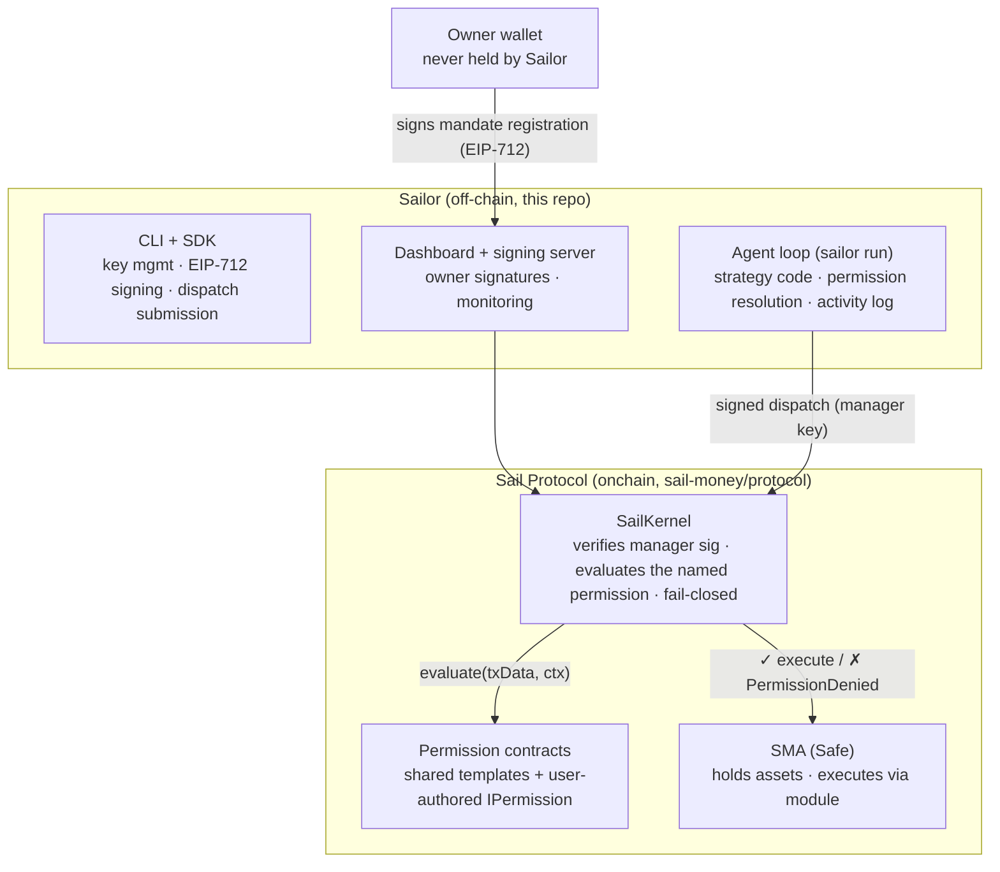

# Architecture: where Sailor ends and the protocol begins

Sailor is deliberately **off-chain tooling for an onchain trust model**. Nothing Sailor does can
exceed what the contracts allow — the security guarantees live onchain; Sailor makes them
operable.

## Onchain (the protocol's responsibility)

- **SailKernel** — the trusted core. Verifies the manager's EIP-712 dispatch signature, calls
  `evaluate()` on the **one** permission the dispatch names (selective model, via `staticcall`
  under a gas cap), and executes through the Safe module only on `true`. Revert, `false`, or gas
  exhaustion → `PermissionDenied`. Batch dispatches go through a single batch-aware permission
  that validates the whole sequence.
- **Permission contracts** — the mandate. Shared templates (configured per account, bound to the
  kernel's registration epoch) or user-authored `IPermission` implementations. This is where
  every financial bound lives: the agent's TypeScript can change without the owner's signature;
  the permission contract cannot.
- **The SMA (Safe)** — custody. The owner's Safe holds the assets and executes; the owner can
  remove the module or revoke permissions at any time.

## Off-chain (Sailor's responsibility)

- **Key management** — generating and encrypting the manager key (geth keystore v3 under
  `.sail/keys/`); the owner key stays in the owner's own wallet, Sailor only requests signatures.
- **EIP-712 signing** — building and signing dispatches (manager), and preparing
  register/revoke/configure payloads for the owner to sign on the browser signing page. The
  Configure signer is version-adaptive: it reads the deployed template's schema (ERC-5267) and
  signs the matching version.
- **Dispatch submission** — resolving which registered permission authorizes a planned call
  (mirroring the kernel's own evaluation off-chain, including the live registration epoch),
  then submitting; calls nothing authorizes are skipped and logged, never sent.
- **Monitoring & control** — `doctor`, `status`, the dashboard, the append-only
  `.sail/activity.jsonl`, and instant session pause/resume.

## The boundary, in one sentence

Sailor can *propose* and *submit*; only the kernel and the owner-signed mandate decide what
*executes* — so a compromised or buggy agent is bounded by contracts it cannot edit, and the
worst case off-chain is a skipped or reverted transaction, never an out-of-mandate one.

For the full trust model, invariants, and known limitations, see the
[protocol repo](https://github.com/sail-money/protocol) and its
[whitepaper](https://github.com/sail-money/protocol/blob/main/docs/whitepaper/Sail_Protocol_Whitepaper.pdf).

---

Feedback: does this boundary description miss something? [Open an issue](https://github.com/sail-money/Sailor/issues).
